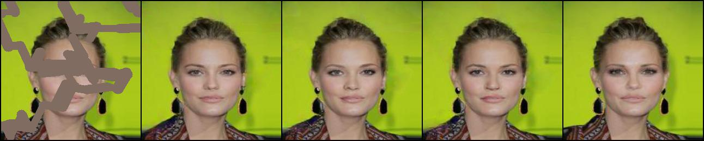
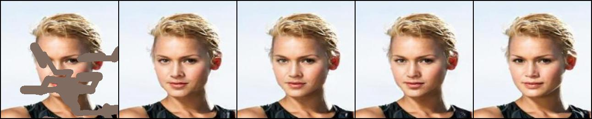
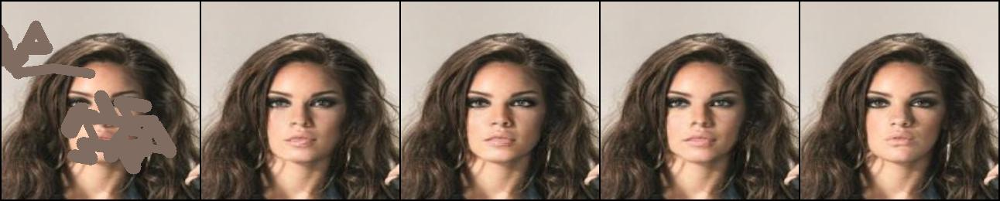
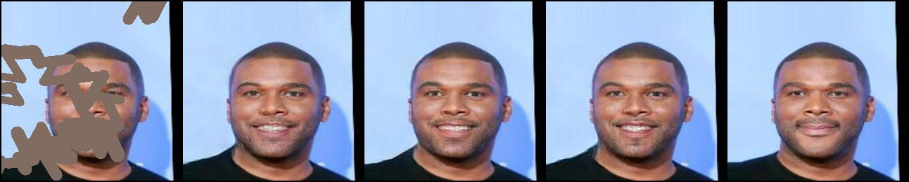
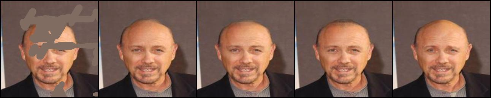
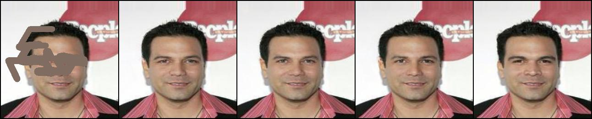

# pytorch-image-inpainting-using-mixed-convolution
A re-implementation and modification of 'Image Inpainting for Irregular Holes Using Partial Convolutions' and 'Free-Form Image Inpainting with Gated Convolution'

## Requirements
- Python 3.6+
- Pytorch 0.4.1+
- Torchvision
- Numpy
- opencv-python

## Usage
* Generally, it is supposed to work on any datasets, Since I have trained the model on CelebA, you should download the [dataset](http://mmlab.ie.cuhk.edu.hk/projects/CelebA.html) first if you want to use my pre-trained model.

* Make sure your Pytorch version is 0.4.1+, it won't work otherwise. The code is fully tested under version 0.4.1 and there maybe some memory [issues](https://github.com/pytorch/pytorch/issues/15774) under 1.0.0. While the cause has not been found yet, it's not guaranteed that it can work properly.

* For now, the input image size is restricted to (256, 256) as I hard coded the mask generation parameters. This issue would be fixed once I feel boring :)

* To run the model, you first have to run sampler.py to generate the training & testing split. (the dataset I used is also provided in case you are as lazy as me.)

```
python3 sampler.py
```
it would generate "img_align_celeba_flist.pkl" with 1/8 full dataset according identity from "identity_CelebA.txt" and 1/10 is set to testing data. (So unfortunately, you can't reuse this part if you want to train the model on a different dataset but its a quiet easy job). The sample rate is hard coded, you can change it to whatever you want and if sample rate = 1, it should include the whole dataset.

* You can check the code to know the exact structure of the pkl file. Just don't forget to provide the mean and var!!!

* A mask generator is also included if you want to see the same set of masks when validation.

* To train
```
python modelTrain.py
```

* To fine-tune
```
python modelTrain.py -f
```
* To test
```
python modelTest.py
```
* There's three models I have trained and tested. ( or  but temp)All the models are in same U-NET archetecture and trained with same loss function. The only difference is that GConv uses all gated convolution, PConv uses all partial convolution while mixed (which is the proposed one) uses two layers of gated convolution to learn the mask and remain others to be partial convolution to reduce parameters. More detailed information can be seen in the paper I will upload days after.

## Some sample results
From left to right: input, PConv, GConv, Mixed, GT. The result is trained on 18k images for 100 epoches and 200 epoches of fine-tuning, with a batch size of 16












